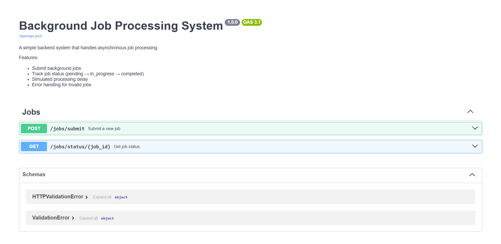
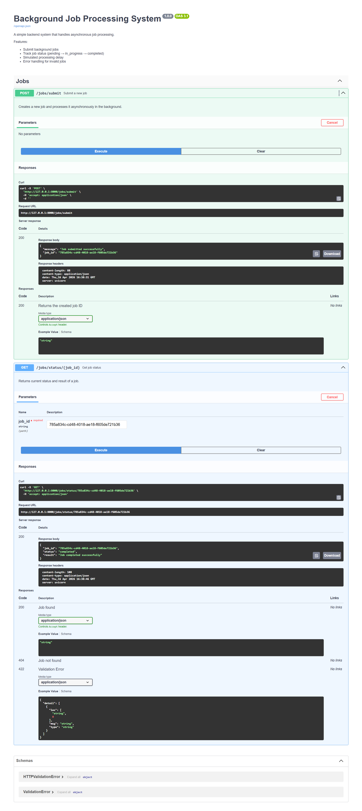

# Background Job Processing System (FastAPI)

## Overview

This project implements an asynchronous job processing system using FastAPI.

## Features

- Submit jobs
- Track job status
- Background processing
- Job lifecycle: pending → in_progress → completed

## Tech Stack

- FastAPI
- SQLite
- SQLAlchemy

## Setup Instructions

1. Clone repo:
   git clone <your-repo-link>

2. Navigate:
   cd job-system

3. Install dependencies:
   pip install -r requirements.txt

4. Run server:
   uvicorn app.main:app --reload

5. Open Swagger:
   http://127.0.0.1:8000/docs

## API Endpoints

### Submit Job

POST /jobs/submit
Response:
{
"job_id": "uuid"
}

### Get Job Status

GET /jobs/status/{job_id}
Response:
{
"status": "pending | in_progress | completed",
"result": "string"
}

## How it's Working?
Job is created → immediately stored in DB. Within ~5–20 ms it is marked as `pending`, meaning it is waiting to be picked up by the background worker. After the worker starts processing (almost instantly after request completion, but practically observable after a short delay), the status changes to `in_progress`, which may last for a few seconds depending on the simulated work (e.g., `sleep(10)`). Once processing finishes, the job is marked as `completed`, or `failed` if an exception occurs.

So the lifecycle is:
**Job created → (5–20 ms) pending → (~few seconds) in_progress → completed/failed**

## Assumptions
- BackgroundTasks used instead of external queue (Celery)
- SQLite used for simplicity

## API Documentation

## Job Submission

